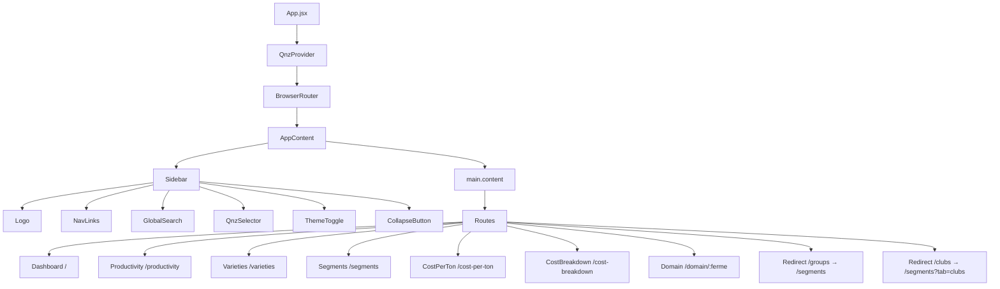

# Design Document: Frontend Theme Redesign

## Overview

The Agri Data Lake frontend is a React 19 + Vite application that currently uses a top navbar, custom CSS bar charts, and separate Groups/Clubs pages. This redesign transforms the UI into a modern dark-first dashboard with:

- A **left sidebar** replacing the top navbar
- **Recharts** replacing all custom CSS bar charts
- A **merged Segments page** combining Groups and Clubs under a single route with tabs
- A **refined design token system** supporting dark/light mode toggle
- **Improved metric cards**, typography, and layout consistency

The redesign is purely frontend — no backend API changes are required. All existing data-fetching logic, routing, and the `QnzContext` are preserved.

---

## Architecture

The application shell is restructured from a top-navbar layout to a sidebar layout. The `App.jsx` component is the primary change point: the `<Navbar>` component is replaced by a `<Sidebar>` component, and the `<main>` content area gains a dynamic left margin that tracks sidebar width.



### Theme Architecture

Theme state is managed at the `App` level (or inside `Sidebar`) using `localStorage`. The active theme class (`dark`) is toggled on `document.body`. All colors are CSS custom properties defined in `App.css`, so switching themes requires only toggling the body class — no React re-renders of individual components.

```mermaid
graph LR
    LS[localStorage theme] --> Init[App init]
    Init --> Body[document.body class]
    Body --> CSS[:root / body.dark tokens]
    CSS --> Components[All components via var()]
    Toggle[ThemeToggle click] --> Body
    Toggle --> LS
```

### Sidebar Collapse Architecture

Sidebar width is tracked in a React state variable (`sidebarWidth`: `240` or `64`). This value is passed down to the main content area as a CSS `marginLeft`. On mobile (< 768px), the sidebar collapses automatically and is shown/hidden via an overlay triggered by a hamburger button.

---

## Components and Interfaces

### `Sidebar` Component

Replaces the existing `Navbar` component entirely.

```jsx
// Props: none (reads from QnzContext and manages own theme/collapse state)
function Sidebar() {
  const [collapsed, setCollapsed] = useState(false)
  const [theme, setTheme] = useState(localStorage.getItem('theme') || 'dark')
  const { selectedQnz, setSelectedQnz, availableQnz } = useQnz()
  // ...
}
```

**Rendered structure:**
```
.sidebar
  .sidebar-header        ← Logo + collapse button
  nav.sidebar-nav
    .nav-section
      NavItem (Dashboard)
      NavItem (Productivity)
      NavItem (Varieties)
      NavItem (Segments)
      NavItem (Cost/Ton)
      NavItem (Cost Breakdown)
  .sidebar-search        ← GlobalSearch (hidden when collapsed)
  .sidebar-qnz           ← QNZ selector
  .sidebar-footer        ← Theme toggle
```

**NavItem sub-component:**
```jsx
function NavItem({ to, icon, label, collapsed }) {
  // renders icon always, label only when !collapsed
  // tooltip via title attribute when collapsed
}
```

### `Segments` Page (new)

Merges `Groups.jsx` and `Clubs.jsx` into a single component at `/segments`.

```jsx
function Segments() {
  const [activeTab, setActiveTab] = useState('groups') // or 'clubs' from ?tab=clubs
  // Renders <GroupsTab /> or <ClubsTab /> based on activeTab
}
```

The `GroupsTab` and `ClubsTab` sub-components contain the exact data-fetching and rendering logic from the current `Groups.jsx` and `Clubs.jsx` respectively, with CSS bar charts replaced by Recharts.

### Recharts Integration Pattern

All chart components follow this pattern:

```jsx
import { BarChart, Bar, XAxis, YAxis, Tooltip, ResponsiveContainer, Cell } from 'recharts'

// Horizontal bar chart (most pages)
<ResponsiveContainer width="100%" height={chartHeight}>
  <BarChart data={data} layout="vertical" margin={{ left: 20, right: 20 }}>
    <XAxis type="number" hide />
    <YAxis type="category" dataKey="name" width={140} tick={{ fill: 'var(--text-secondary)', fontSize: 13 }} />
    <Tooltip
      contentStyle={{ background: 'var(--surface)', border: '1px solid var(--border)', borderRadius: 8 }}
      formatter={(value) => [formatNum(value), label]}
    />
    <Bar dataKey="value" radius={[0, 6, 6, 0]}>
      {data.map((entry, i) => (
        <Cell key={i} fill={entry.value > avg ? 'var(--accent)' : 'var(--accent-warning)'} />
      ))}
    </Bar>
  </BarChart>
</ResponsiveContainer>
```

**Stacked bar chart (CostBreakdown per-farm):**
```jsx
<BarChart data={farmData} layout="vertical">
  <Bar dataKey="main_doeuvre" stackId="a" fill={categoryColors["Main D'œuvre"]} />
  <Bar dataKey="echassier" stackId="a" fill={categoryColors["Echassier"]} />
  {/* ... */}
</BarChart>
```

### `MetricCard` Component (optional extraction)

The existing inline `.metric` divs can optionally be extracted into a reusable component:

```jsx
function MetricCard({ label, value, variant, subLabel }) {
  // variant: 'default' | 'best' | 'warning'
}
```

---

## Data Models

No new data models are introduced. The redesign consumes the same API responses as the current implementation. The relevant frontend data shapes are:

### Theme State
```js
// Stored in localStorage under key 'theme'
type ThemePreference = 'light' | 'dark'
```

### Sidebar State
```js
{
  collapsed: boolean,       // true = 64px, false = 240px
  mobileOpen: boolean,      // overlay open on mobile
}
```

### Segments Tab State
```js
{
  activeTab: 'groups' | 'clubs',
  // Initialized from URL search param ?tab=clubs
}
```

### CSS Design Tokens (updated)

The existing `:root` and `body.dark` token sets are updated to match the new dark-first spec:

| Token | Dark Mode | Light Mode |
|---|---|---|
| `--bg` | `#0f172a` | `#f8fafc` |
| `--surface` | `#1e293b` | `#ffffff` |
| `--border` | `rgba(255,255,255,0.08)` | `rgba(0,0,0,0.08)` |
| `--text` | `#f1f5f9` | `#0f172a` |
| `--text-muted` | `#64748b` | `#64748b` |
| `--accent` | `#10b981` | `#10b981` |
| `--accent-warning` | `#f59e0b` | `#f59e0b` |
| `--shadow-md` | `0 4px 24px rgba(0,0,0,0.4)` | `0 4px 24px rgba(0,0,0,0.08)` |
| `--radius-sm` | `6px` | `6px` |
| `--radius-md` | `12px` | `12px` |
| `--radius-lg` | `16px` | `16px` |

**Typography scale:**
| Role | Size | Weight |
|---|---|---|
| Page title (`h2`) | `1.75rem` | `700` |
| Section heading (`h3`) | `1.1rem` | `600` |
| Table header (`th`) | `0.8rem` | `600` uppercase |
| Body | `0.95rem` | `400` |
| Nav links | `0.9rem` | `500` |

---

## Correctness Properties

*A property is a characteristic or behavior that should hold true across all valid executions of a system — essentially, a formal statement about what the system should do. Properties serve as the bridge between human-readable specifications and machine-verifiable correctness guarantees.*

This feature is a UI/UX redesign involving theme toggling, sidebar state management, routing redirects, and chart rendering. The core logic amenable to property-based testing is the **theme persistence** and **sidebar state** behavior. Chart rendering and layout are best covered by snapshot and example-based tests.

### Property 1: Theme toggle is a round trip

*For any* initial theme state (light or dark), toggling the theme twice should return to the original theme value.

**Validates: Requirements 1.6**

### Property 2: Theme preference is persisted and restored

*For any* theme value written to localStorage, reloading the application state should produce the same active theme.

**Validates: Requirements 1.5**

### Property 3: Sidebar width invariant

*For any* sequence of collapse/expand toggle operations, the sidebar width should always be exactly one of the two valid states: 240px (expanded) or 64px (collapsed) — never any other value.

**Validates: Requirements 2.1, 2.7**

### Property 4: Active nav link matches current route

*For any* route the user navigates to, exactly one navigation link in the sidebar should be in the active state, and its `to` prop should match (or be a prefix of) the current pathname.

**Validates: Requirements 2.4**

### Property 5: Legacy route redirects

*For any* navigation to `/groups`, the application should redirect to `/segments`. *For any* navigation to `/clubs`, the application should redirect to `/segments?tab=clubs`.

**Validates: Requirements 4.6, 4.7**

---

## Error Handling

### API Errors
All pages already handle API errors with `try/catch` and `console.error`. The redesign adds a visible error state (replacing the silent failure) using a styled error card component when data fails to load.

### Theme Initialization
If `localStorage` is unavailable (e.g., private browsing restrictions), the theme defaults to `'dark'` without throwing. This is handled with a `try/catch` around `localStorage.getItem`.

### Sidebar on Mobile
If the viewport is below 768px on initial load, the sidebar initializes in collapsed state. A `ResizeObserver` or `window.matchMedia` listener handles dynamic viewport changes.

### Recharts with Empty Data
All `ResponsiveContainer` / `BarChart` usages guard against empty arrays — an empty `data` prop renders nothing rather than crashing. Each chart section is wrapped in a conditional render check.

### Route Redirects
The `/groups` and `/clubs` legacy routes use React Router's `<Navigate>` component for declarative redirects, ensuring they work correctly even if the user bookmarks the old URLs.

---

## Testing Strategy

### Unit Tests (Vitest + React Testing Library)

The project currently has no test setup. The redesign introduces Vitest and React Testing Library as the standard test stack (consistent with the Vite ecosystem).

**Example-based tests:**
- `Sidebar` renders all 6 navigation links
- `Sidebar` applies `active` class to the link matching the current route
- `Sidebar` renders collapsed state (64px, icons only) when `collapsed=true`
- `Segments` renders "Groups" tab content by default
- `Segments` renders "Clubs" tab content when `?tab=clubs` is in the URL
- `ThemeToggle` switches body class from `dark` to `light` and back
- `/groups` route renders a `<Navigate to="/segments" />`
- `/clubs` route renders a `<Navigate to="/segments?tab=clubs" />`
- `MetricCard` renders label, value, and applies correct color class for `variant="best"` and `variant="warning"`

**Edge case tests:**
- `GlobalSearch` is hidden when sidebar is collapsed
- Sidebar auto-collapses when viewport width < 768px
- Theme defaults to `'dark'` when localStorage is empty

### Property-Based Tests (Vitest + fast-check)

fast-check is the standard property-based testing library for the JavaScript/TypeScript ecosystem and integrates natively with Vitest.

Each property test runs a minimum of **100 iterations**.

**Property 1: Theme toggle round trip**
```
Feature: frontend-theme-redesign, Property 1: Theme toggle is a round trip
```
Generate a random initial theme (`'light'` | `'dark'`), apply it, toggle twice, assert the result equals the initial value.

**Property 2: Theme persistence**
```
Feature: frontend-theme-redesign, Property 2: Theme preference is persisted and restored
```
Generate a random theme value, write it via the toggle handler, read back from localStorage, assert equality.

**Property 3: Sidebar width invariant**
```
Feature: frontend-theme-redesign, Property 3: Sidebar width invariant
```
Generate a random sequence of `n` toggle operations (n ∈ [1, 50]), apply them to the sidebar state, assert the final width is always `240` or `64`.

**Property 4: Active nav link matches route**
```
Feature: frontend-theme-redesign, Property 4: Active nav link matches current route
```
Generate a random valid route from the set of known routes, render the sidebar with that location, assert exactly one nav item has the active class and its path matches.

**Property 5: Legacy route redirects**
```
Feature: frontend-theme-redesign, Property 5: Legacy route redirects
```
For each legacy route (`/groups`, `/clubs`), assert the rendered output is a redirect to the correct target — this is deterministic so it runs as a parameterized example test rather than a randomized property.

### Integration Tests

- Full page render of `Dashboard` with mocked API responses renders Recharts `BarChart` components
- Full page render of `Segments` with mocked API responses shows correct tab content
- `Domain` page renders without crashing when cost data is absent

### Snapshot Tests

- `Sidebar` expanded state snapshot
- `Sidebar` collapsed state snapshot
- `MetricCard` with each variant snapshot

These snapshots catch unintended visual regressions during future changes.
